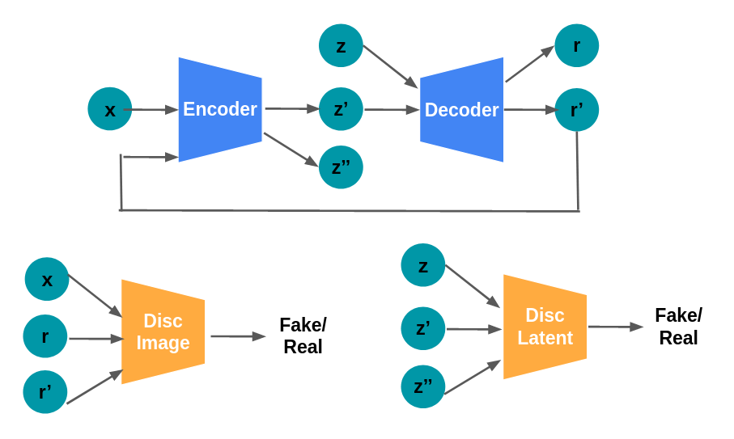

# Fantasy Map Generator

Using Generative Adversarial Networks (GANs) to produce awesome looking fantasy maps.

Implementation details: A simpler version (i.e., removal of the conditional image generation functionality) of the AE-GAN I implemented in my [Pokemon Sprite Generator](https://github.com/amanda-lambda/pokemon-sprite-generator) project. For more details, definitely check out that repo! I'm working on having this GAN though scalable to larger sizes (originally 96x96 - want to get up to 256x256.)

Below is a rough architecture flow diagram of what's happening during training. In this case `x` and `r` are images, `z` are latents. We can compute reconstruction losses between `recon_loss(x, r')` and generator GAN losses from  `disc_image(r)`, `disc_image(r')`, `disc_latent(z')`, and `disc_latent(z'')`. Conversely, we can compute discriminator losses from `disc_image(x)`, `disc_image(r)`, `disc_image(r')` and `disc_latent(z)`, `disc_image(z')`,`disc_image(z'')`. 



[NOTE] Results coming soon! Currently training a 128x128 version of the net, and things are looking good.

# Setup 

1. I used the Selenium IDE to build the dataset of fantasy maps. Credits to @mewo2, who built the [map generator](https://mewo2.com/notes/terrain/) I used to construct the dataset. The dataset is available on Google Drive [link](https://drive.google.com/file/d/176W29rLNqD4a6xEs5UicnChoq49ufgM5/view?usp=sharing). The dataset contains 4000 images.

2. Install necessary python packages. If doing training, I'd highly reccomend using a GPU. These are the package versions I was using, but I'm sure it would work for other combinations as well.
```
python==3.6.12
torch==1.8.1+cu111
torchvision==0.9.1+cu111
PIL==8.0.1
tensorboard==2.5.0
numpy==1.19.4
```

3. (Optional) Download the pretrained model:
```
cd fantasy-map-generator/
mkdir pretrained
cd pretrained/
# TBD
wget <URL>
```

# Quick Start

The program is run via the command line. There are two modes, `train` or `sample`, which we'll outline in more detail below. For now, here is the full list of command line options:

```
python main.py -h

usage: main.py [-h] [--mode {train,sample}] [--save_dir SAVE_DIR]
               [--load_dir LOAD_DIR] [--use_gpu] [--root_dir ROOT_DIR]
               [--csv_file CSV_FILE] [--batch_size BATCH_SIZE]
               [--learning_rate LEARNING_RATE] [--num_epochs NUM_EPOCHS]
               [--types TYPES]

pokemon-sprite-generator options

optional arguments:
  -h, --help            show this help message and exit
  --mode {train,sample}
                        run the network in train or sample mode
  --save_dir SAVE_DIR   path to save model, logs, generated images
  --load_dir LOAD_DIR   path to model to load
  --use_gpu             if set, train on gpu instead of cpu
  --root_dir ROOT_DIR   path to the training data
  --csv_file CSV_FILE   path to the training data
  --batch_size BATCH_SIZE
                        batch size
  --learning_rate LEARNING_RATE
                        learning rate
  --num_epochs NUM_EPOCHS
                        number of epochs
  --types TYPES         pokemon types, comma seperated
``` 

## Train 

To train the network from scratch, I'd highly recommend using a CUDA-enabled GPU. It took me about ____ TBD. I'd also recommend keeping the default network hyperparameters. So, your command to train might look like:

```
python main.py --mode train --save_dir logs 
```

## Sample

If you'd like to generate a random map using the pre-trained model, make sure to first download the pre-trained model weights from step 3 of the `Setup` section. To generate a map, your command might look like:

```
python main.py --mode sample --save_dir logs --load_dir pretrained 
```

The generated map will be saved to the `save_dir` specified.


# Results 

TBD - training curves, visualizations, etc.


# References

Some inspirations for this work!

- Pokemon Sprite Generator (own): https://github.com/amanda-lambda/pokemon-sprite-generator
- AAE (Makhzani '15): [paper](https://arxiv.org/abs/1511.05644), [code](https://github.com/neale/Adversarial-Autoencoder)
- AEGAN (Lazarou '20): [paper](https://arxiv.org/abs/2004.05472), [code](https://github.com/ConorLazarou/PokeGAN)
- CAAE (Zhang '17): [paper](http://web.eecs.utk.edu/~zzhang61/docs/papers/2017_CVPR_Age.pdf), [code](https://github.com/mattans/AgeProgression/tree/v1.0.0)
- Soumith Ganhacks: [github](https://github.com/soumith/ganhacks)